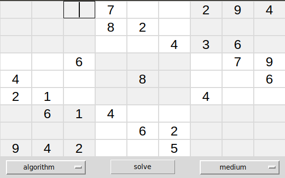
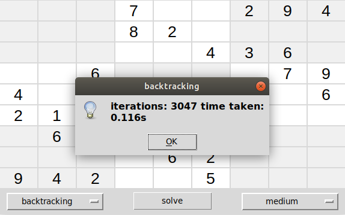
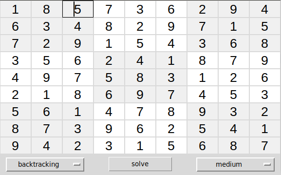

<!-- PROJECT LOGO -->
<br />
<p align="center">

  <h3 align="center">Solving sudoku with Artificial Intelligence</h3>

  <p align="center">
    Problem Solving Challenges :: Constraint Satisfaction Problems :: Fundamentals of AI 
    <br />
  </p>
  </br>
  <p align="center">
    
  </p>
</p>

<!-- TABLE OF CONTENTS -->
<details open="open">
  <summary><h2 style="display: inline-block">Table of Contents</h2></summary>
  <ol>
    <li><a href="#about">About</a></li>
    <li><a href="#testing">Testing</a></li>
    <li><a href="#simulation">Simulation</a></li>
    <li><a href="#contribution">Contribution</a></li>
    <li><a href="#license">License</a></li>
    <li><a href="#contact">Contact</a></li>
  </ol>
</details>

<!-- ABOUT THE PROJECT -->

## About

|            Algorithm metrics (1/2)            |              Solved sudoku board (2/2)               |
| :-------------------------------------------: | :--------------------------------------------------: |
|  |  |

<div style="text-align: justify">
  
**Motivation**: Academic project for Fundamentals of Artificial Intelligence, M2AI. Develop a Sudoku Resolver using CSP. Try to build the CSP system as generic as possible. Note that constrains can be defined in code, or described as rules. Try to find the best solution for easily tweaking the constrains by a standard user.

**Implementation**: All the algorithms are implemented in Python. There's also a user interface implemented with Tkinter. The user can input their own problem or select between three premade boards (eady, medium, hard). There's currently implemented two algorithms, a recursive backtracking algorithm and a the same algorithm but with CSP techniques added to it. From the metrics we can see that the CSP backtracking algorithm performs worst than the normal backtracking but this can happen due to the huge function calls during the CSP process. Otherwise is quite memory efficient compared to the generic backtracking algorithm 
  
**_Tested with_** Backtracking algorithm and CSP based backtracking algorithm.

**_Built With_** Python3.6 and tkinter package for the interface itself.

<!-- TESTING -->

## Testing

**Backtracking algorithm**

<!-- create a center table of metrics fro each algorithm-->
<table align="center" border="1" cellpadding="5" cellspacing="0" style="width:80%">
  <tr>
    <th>Board</th>
    <th>Iterations</th>
    <th>Solving time</th>
  </tr>
  <tr>
    <td>Clean Board</td>
    <td>391</td>
    <td>0.016 seconds</td>
  </tr>
  <tr>
    <td>Easy Board</td>
    <td>105</td>
    <td>0.005 seconds</td>
  </tr>
  <tr>
    <td>Medium Board</td>
    <td>3047</td>
    <td>0.107 seconds</td>
  </tr>
  <tr>
    <td>Hard Board</td>
    <td>103922</td>
    <td>3.843 seconds</td>
  </tr>
</table>

**CSP based backtracking algorithm**

<!-- create a center table of metrics fro each algorithm-->
<table align="center" border="1" cellpadding="5" cellspacing="0" style="width:80%">
  <tr>
    <th>Board</th>
    <th>Iterations</th>
    <th>Solving time</th>
  </tr>
  <tr>
    <td>Clean Board</td>
    <td>240</td>
    <td>0.907 seconds</td>
  </tr>
  <tr>
    <td>Easy Board</td>
    <td>65</td>
    <td>0.095 seconds</td>
  </tr>
  <tr>
    <td>Medium Board</td>
    <td>1443</td>
    <td>3.017 seconds</td>
  </tr>
  <tr>
    <td>Hard Board</td>
    <td>30391</td>
    <td>60.830 seconds</td>
  </tr>
</table>

<!-- SIMULATION -->

## Simulation

```python
pip install -r requirements.txt # pygame and pyswip
python main.py # run the GUI
```

## Contribution

Feel free to submit a pull request with a better algorithm for the project.

```python
class Solver(object):
  def __init__(self):
    self.algorithms = {
      'backtracking': self.backtracking,
      'csp_backtracking': self.csp_backtracking,
      'your_algorithm': self.your_algorithm
    }

  def your_algorithm(self, board):
    """
    your algorithm code here
    make sure you update self.board
    """
    return board
```

## License

Distributed under the MIT License. See `LICENSE` for more information.

<!-- CONTACT -->

## Contact

Fábio Oliveira - [LinkedIn](https://www.linkedin.com/in/fabioo29/) - fabiodiogo29@gmail.com

Project Link: [https://github.com/fabioo29/csp-sudoku-solver](https://github.com/fabioo29/csp-sudoku-solver)  
Project built as a Msc. Applied Artificial Intelligence Student.
